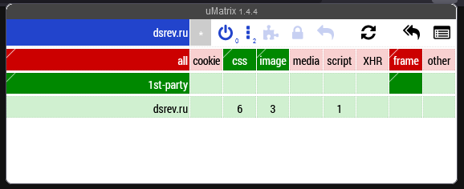

# TL;DR: I *care* about your privacy and I don't use CDNs, Cloudflare or analytics.

I am one of the supporters of Free and Open Source Software and I respect privacy, despite the fact that I'm Russian (Russia is not good at this tbh).

I don't use CDNs and I keep the font (called [Sansation](https://www.fontsquirrel.com/fonts/sansation) btw) and [Fork Awesome](https://forkaweso.me/Fork-Awesome/) in my repository.

I am **strongly** against the use of proprietary analytics services like Google Analytics or Yandex.Metrika, so you will not see this on my site.

As for Cloudflare... meh. It would be good for small sites that need protection from DDoS attacks, but not for my site. I'm not talking about unpleasant situations related to Cloudflare (if you're interested - find it yourself)...

And... This site is hosted by... GitHub. Yes, that's right, **GitHub**. I'm tired of paying about $15 every year just to host my static website(s). GitHub may or may not keep track of whether or not you've visited my site. Honestly - I don't know. But I do know that they don't embed something like Google Analysis out of nowhere.

## You definitely keep everything in one place, don't you?

Yup. Here's a screenshot from uMatrix, if you don't believe me:

## This reminds me of something...

If you've read David Revoy's blog at any point - yes, he too struggles with the same things I do. If you're not aware of it, here's the link: https://www.davidrevoy.com/article590/my-fight-against-cdn-libraries

That's it.